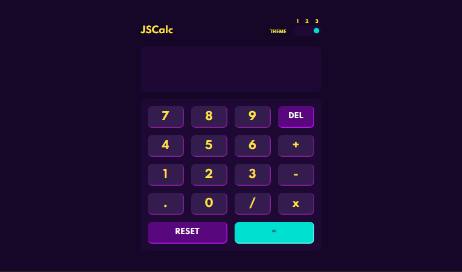
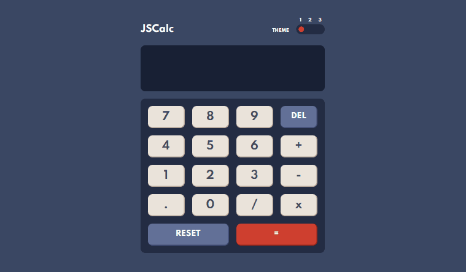
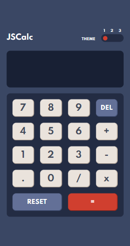
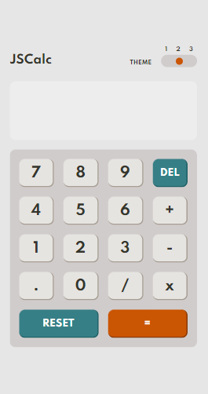
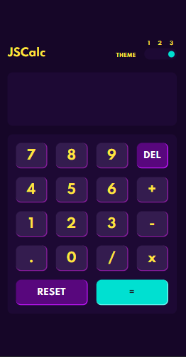

# JSCalc

This Javascript Calculator is a solution to the [Calculator app challenge on Frontend Mentor](https://www.frontendmentor.io/challenges/calculator-app-9lteq5N29). Frontend Mentor challenges help you improve your coding skills by building realistic projects.

  

## Table of contents

- [Overview](#overview)
  - [The challenge](#the-challenge)
  - [Screenshots](#screenshots)
  - [Link](#link)
- [My process](#my-process)
  - [Built with](#built-with)
  - [What I learned](#what-i-learned)
  - [Continued development](#continued-development)
- [Author](#author)

## Overview

### The challenge

Users should be able to:

- See the size of the elements adjust based on their device's screen size
- Perform mathmatical operations like addition, subtraction, multiplication, and division
- Adjust the color theme based on their preference

### Screenshots

  

  
  
  

### Link

- Live Site URL: [JSCalc - Click here!](https://your-live-site-url.com)

## My process

### Built with

- Semantic HTML5 markup
- CSS custom properties
- Flexbox
- CSS Grid
- [SASS](https://sass-lang.com/) - CSS Preprocessor
- Vanilla JS

### What I learned

To solve this challenge I decided to include SASS in the stack as a way to learn how to use this tool. While developing the project in parallel, I learned and implemented the main features of SASS. I also wanted to practice a little more of my programming logic with Javascript.

### Continued development

Now my biggest goal will be to write the codes in Javascript in a better way, probably following some programming paradigm like OOP or functional. And also learn to use scss which is another SASS syntax.

## Author

Made with 💜 by Evelyn Monteiro 👋
 

